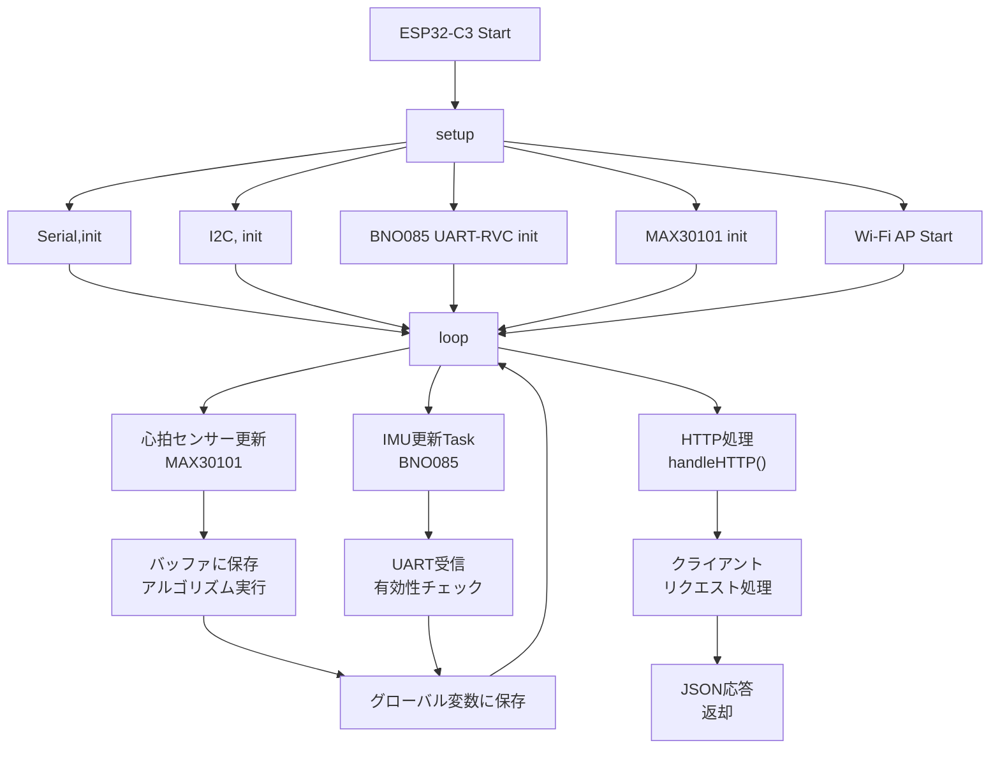
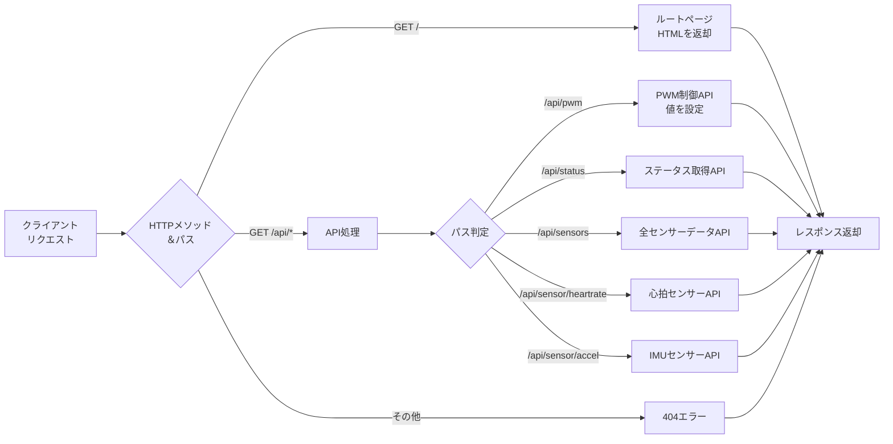
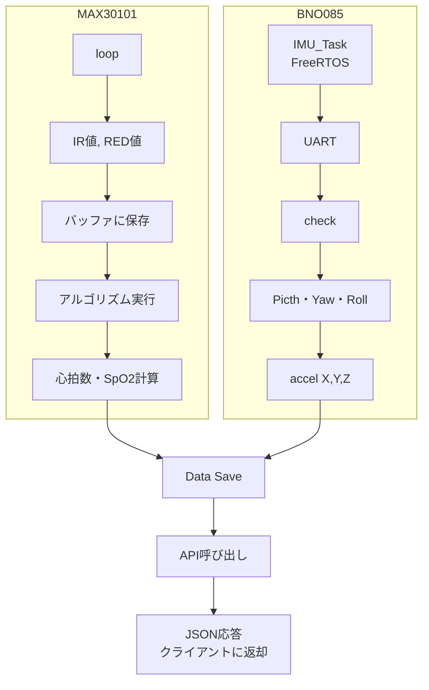
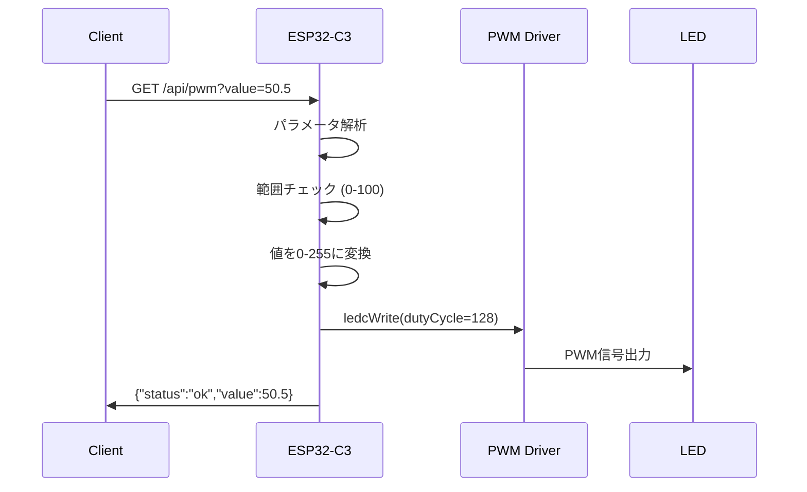
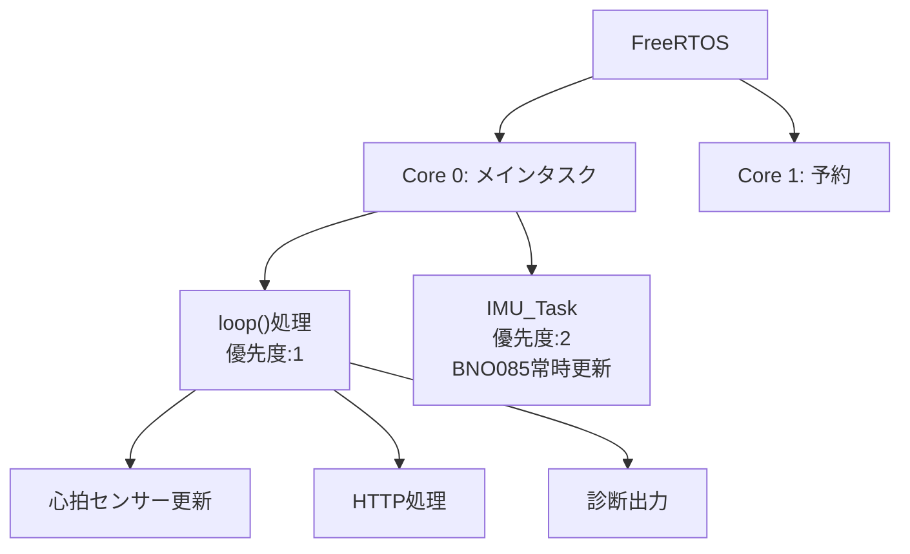

# ESP32-C3 Web API 仕様書

## 概要
ESP32-C3をアクセスポイントとして起動し、RESTful Web APIを提供します。
センサーデータの取得やPWM制御が可能です。

## 接続情報

### Wi-Fi設定
- **SSID**: `ESP32-C3_AP`
- **IPアドレス**: `192.168.4.1` (デフォルト)
- **ポート**: `80`
- **最大接続数**: 4台

### ベースURL
```
http://192.168.4.1
```

---

## エンドポイント一覧

### 1. ルートページ
簡易的なWebページを表示します。

- **エンドポイント**: `/`
- **メソッド**: `GET`
- **レスポンス形式**: `text/html`

**レスポンス例**:
```html
<!DOCTYPE html>
<html>
<head>
    <title>ESP32-C3 Web API</title>
</head>
<body>
    <h1>ESP32-C3 Web API</h1>
</body>
</html>
```

---

### 2. PWM制御API
PWM出力値を設定します。

- **エンドポイント**: `/api/pwm`
- **メソッド**: `GET`
- **パラメータ**:
  - `value` (必須): PWM値 (float) (0~100)

**リクエスト例**:
```
GET /api/pwm?value=50.5
```

**レスポンス** (`application/json`):

成功時:
```json
{
  "status": "ok",
  "value": 50.5
}
```

エラー時:
```json
{
  "status": "error",
  "message": "value parameter required"
}
```

---

### 3. ステータス取得API
システムステータス情報を取得します。

- **エンドポイント**: `/api/status`
- **メソッド**: `GET`
- **レスポンス形式**: `application/json`

**リクエスト例**:
```
GET /api/status
```

**レスポンス例**:
```json
{
  "connected_clients": 2,
  "ip": "192.168.4.1",
  "ssid": "ESP32-C3_AP"
}
```

**フィールド説明**:
- `connected_clients`: 現在接続しているクライアント数
- `ip`: アクセスポイントのIPアドレス
- `ssid`: アクセスポイントのSSID

---

### 4. 全センサーデータ取得API
すべてのセンサーデータを一括で取得します。

- **エンドポイント**: `/api/sensors`
- **メソッド**: `GET`
- **レスポンス形式**: `application/json`

**リクエスト例**:
```
GET /api/sensors
```

**レスポンス例**:
```json
{
  "timestamp": 12345678,
  "heart_rate": 72,
  "spo2": 98,
  "temperature": 36.5,
  "Pitch": 10.25,
  "Yaw": -5.30,
  "Roll": 2.15
}
```

**フィールド説明**:
- `timestamp`: システム起動からの経過時間 (ミリ秒)
- `heart_rate`: 心拍数 (bpm), 無効時は `-1`
- `spo2`: 血中酸素飽和度 (%), 無効時は `-1`
- `temperature`: 温度 (°C)
- `Pitch`: ピッチ角 (度)
- `Yaw`: ヨー角 (度)
- `Roll`: ロール角 (度)

---

### 5. 心拍数センサーデータAPI
心拍数・SpO2センサー (MAX30105) のデータを取得します。

- **エンドポイント**: `/api/sensor/heartrate`
- **メソッド**: `GET`
- **レスポンス形式**: `application/json`

**リクエスト例**:
```
GET /api/sensor/heartrate
```

**レスポンス例**:
```json
{
  "sensor": "heartrate",
  "hr_valid": true,
  "spo2_valid": true,
  "heart_rate": 72,
  "spo2": 98,
  "temperature": 36.5,
  "ir_value": 50000,
  "red_value": 45000
}
```

**フィールド説明**:
- `sensor`: センサー種別 (`"heartrate"`)
- `hr_valid`: 心拍数データの有効性 (boolean)
- `spo2_valid`: SpO2データの有効性 (boolean)
- `heart_rate`: 心拍数 (bpm), 無効時は `-1`
- `spo2`: 血中酸素飽和度 (%), 無効時は `-1`
- `temperature`: 温度 (°C)
- `ir_value`: 赤外線LED受光値
- `red_value`: 赤色LED受光値

---

### 6. 加速度・姿勢センサーデータAPI
加速度・姿勢センサー (BNO08x) のデータを取得します。

- **エンドポイント**: `/api/sensor/accel`
- **メソッド**: `GET`
- **レスポンス形式**: `application/json`

**リクエスト例**:
```
GET /api/sensor/accel
```

**レスポンス例**:
```json
{
  "sensor": "accelerometer",
  "valid": true,
  "Pitch": 10.254,
  "Yaw": -5.301,
  "Roll": 2.152,
  "x_accel": 0.123,
  "y_accel": -0.056,
  "z_accel": 9.801
}
```

**フィールド説明**:
- `sensor`: センサー種別 (`"accelerometer"`)
- `valid`: データの有効性 (boolean)
- `Pitch`: ピッチ角 (度)
- `Yaw`: ヨー角 (度)
- `Roll`: ロール角 (度)
- `x_accel`: X軸加速度 (m/s²)
- `y_accel`: Y軸加速度 (m/s²)
- `z_accel`: Z軸加速度 (m/s²)

---

### 7. 404エラー
存在しないエンドポイントへのアクセス時に返されます。

**レスポンス** (`application/json`):
```json
{
  "status": "error",
  "message": "Not Found"
}
```

---

## 使用例

### curlコマンドでのアクセス例

**ステータス確認**:
```bash
curl http://192.168.4.1/api/status
```

**PWM制御**:
```bash
curl "http://192.168.4.1/api/pwm?value=75.0"
```

**全センサーデータ取得**:
```bash
curl http://192.168.4.1/api/sensors
```

**心拍数データ取得**:
```bash
curl http://192.168.4.1/api/sensor/heartrate
```

**加速度データ取得**:
```bash
curl http://192.168.4.1/api/sensor/accel
```

---

## エラーコード

| HTTPステータス | 説明 |
|--------------|------|
| 200 | 成功 |
| 400 | リクエストエラー (パラメータ不足など) |
| 404 | エンドポイントが見つからない |

---

## 注意事項

1. **センサー初期化**: APIを使用する前に、センサーが正しく初期化されている必要があります
2. **データ更新頻度**: センサーデータは1秒ごとに更新されます
3. **接続台数制限**: 最大4台まで同時接続可能です
4. **タイムアウト**: I2C通信のタイムアウトは1000msに設定されています

---

## システムフローチャート

### メインシステムフロー



### API リクエスト処理フロー



### センサーデータ取得フロー



### PWM制御シーケンス



### FreeRTOSマルチタスク構成


---

## 更新履歴

- 2025-12-21: 初版作成
- 2026-01-10: Graphvizフローチャート追加
